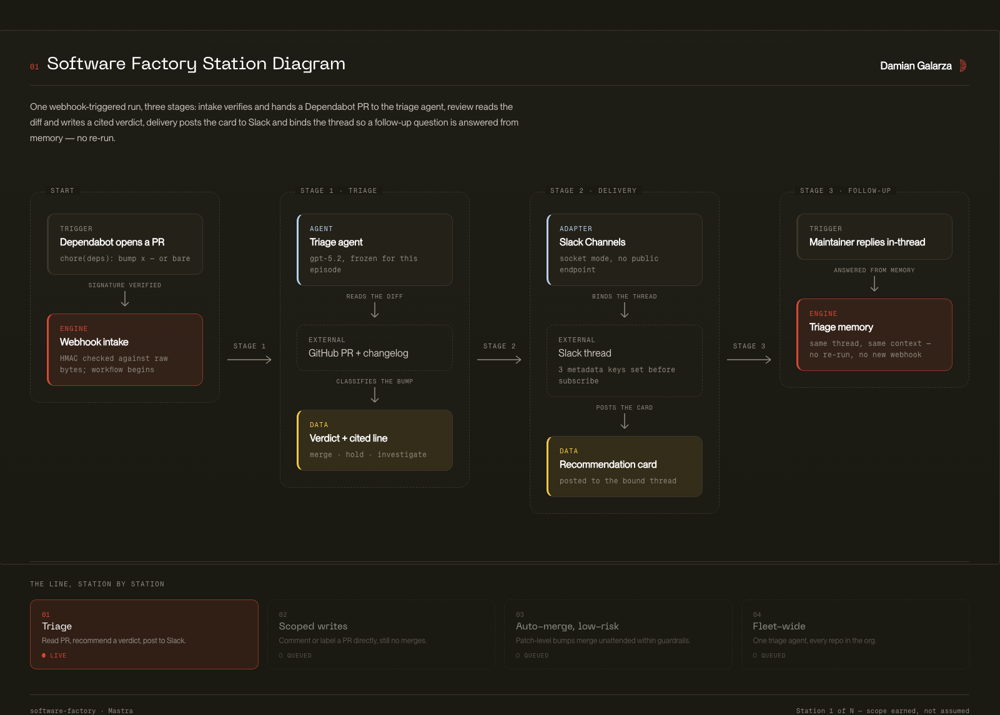
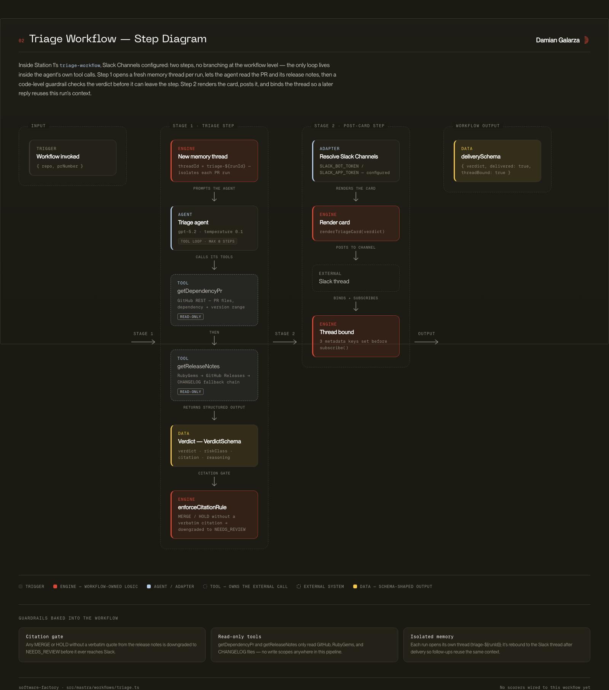

# Architecture

## Overview
software-factory is a [Mastra](https://mastra.ai/) project implementing a *software factory*: a series of agents with progressively increasing delegated scope, built station by station. Station 1 is a read-only Dependabot dependency-triage agent. This document describes the structural conventions and will be extended as stations are added.

## Codemap

### `src/mastra/` -- Application root
All Mastra primitives (agents, tools, workflows, scorers) are registered in `src/mastra/index.ts`, which constructs and exports the `Mastra` instance. This is the single composition root for the app.

Key modules:
- `index.ts` -- Composition root: registers workflows, agents, scorers, server routes, storage, logger, and observability
- `agents/` -- Agent definitions
- `tools/` -- Tool definitions consumed by agents
- `workflows/` -- Multi-step workflow definitions built from `createStep`/`createWorkflow`
- `scorers/` -- Eval scorers attached to agents for observability/quality grading
- `routes/` -- Custom HTTP endpoints (`registerApiRoute`), e.g. the GitHub webhook intake

### `src/lib/` -- Framework-free helpers
Pure functions and external-service clients with no Mastra dependency (signature verification, Dependabot PR parsing). Unit-tested directly in `test/`.

The primitive directories are populated as stations are built; the clean scaffold (tag `ep1-scaffold`) contains only the composition root.

### `.agents/skills/mastra/` -- Mastra framework skill
Reference documentation for building with Mastra (core concepts, API references, migration guides, common errors). Load this before doing Mastra-specific work, per `AGENTS.md`.

## Diagrams
Rendered as PNGs below for GitHub; each has a matching self-contained HTML file in `docs/architecture/` (open directly in a browser, no build step or network needed -- fonts and assets are inlined).

### Station 1, end to end
Dependabot trigger through webhook intake, the triage workflow, Slack delivery, and the in-thread follow-up loop, plus where Station 1 sits in the planned station sequence.

Interactive version: [`station-1-overview.html`](docs/architecture/station-1-overview.html)

### `triage-workflow` step by step
`src/mastra/workflows/triage.ts` itself: the two-step chain, the agent's read-only tool loop, the `enforceCitationRule` guardrail, and the Slack post/bind step.

Interactive version: [`triage-workflow.html`](docs/architecture/triage-workflow.html)

## Invariants

- All agents, tools, workflows, and scorers must be registered in `src/mastra/index.ts` -- there is no auto-discovery.
- Storage is a `MastraCompositeStore`: a default `LibSQLStore` (`file:./mastra.db`) plus a `DuckDBStore` scoped to the `observability` domain. Do not instantiate ad-hoc storage elsewhere.
- Observability is centrally configured in `index.ts` with a `SensitiveDataFilter` span processor -- sensitive data (passwords, tokens, keys) is redacted before export. Do not bypass this by logging raw request/response payloads elsewhere.
- The `mastra dev`/`mastra build`/`mastra start` scripts (via `@mastra/core`) own the runtime. Custom HTTP endpoints are registered as `server.apiRoutes` entries (`registerApiRoute`) in `src/mastra/index.ts`, live under `src/mastra/routes/`, and must not use the reserved `/api` prefix.
- Inbound webhook routes verify the request signature against the raw body bytes before any parsing or processing -- never "temporarily" skip this.
- There is no ORM or hand-written SQL -- persistence goes through Mastra's storage abstraction only.

## Boundaries

- `src/mastra/index.ts` is the only file that should import from all four primitive directories (`agents/`, `tools/`, `workflows/`, `scorers/`) to wire them together. Individual primitive files should not import each other's siblings directly except where a workflow step needs an agent (call `mastra.getAgent(...)` at runtime rather than importing the agent module directly).
- Tools are the only place external HTTP calls should live. Agents and workflows should not make raw `fetch` calls directly except within a `createStep` execute function.

## Cross-Cutting Concerns

### Error Handling
No centralized error-handling layer exists yet. Throw plain `Error`s from tool/step `execute` functions until a project-specific error strategy is established.

### Logging & Observability
Structured logging via `PinoLogger` (configured in `index.ts`, level `info`). Observability events are exported to both Mastra Storage and the Mastra Platform (if `MASTRA_PLATFORM_ACCESS_TOKEN` is set), with sensitive data redacted via `SensitiveDataFilter`.

### Authentication & Authorization
No server auth layer yet. Inbound webhooks must verify their signatures (e.g. GitHub `X-Hub-Signature-256`) in the route handler before any processing.

### Configuration
Secrets and per-environment settings come from environment variables -- see `.env.example` for the full list. Model IDs are set inline where agents are defined and frozen per episode.
