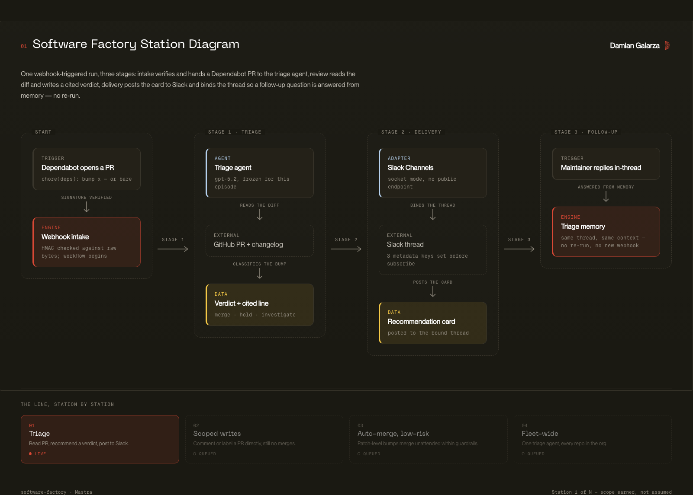

# Software Factory

**A Dependabot triage agent built with [Mastra](https://mastra.ai/), and an open build log for delegating real work to AI agents one station at a time.**

Dependabot opens eleven pull requests. Nobody reads eleven changelogs. Somebody clicks merge.

This repo is a working alternative: an agent that reads every intermediate release's notes, checks the PR out in a disposable VM, runs the suite, and then tries to break the assertions to see whether the suite would even notice. It posts one card to Slack and stops. It cannot merge, comment, or push, because the GitHub App behind it has no write permissions at all.

It's built in the open, station by station, each one holding a little more delegated scope than the last and only after the previous rung has earned it.

## The idea worth stealing

Most agent demos ask you to trust the model's account of what it did. This one doesn't.

Three rules decide what a verdict is *allowed to claim*. All three run in plain TypeScript the model never touches, after the agent has finished talking. See [`src/mastra/agents/verdict.ts`](src/mastra/agents/verdict.ts).

**The citation rule.** A `MERGE` or `HOLD` must quote the exact release-notes line it rests on, verbatim, plus the version it appeared in. Without a quote, the verdict is rewritten to `NEEDS_REVIEW` before it can reach a card.

**The evidence rule.** The suite writes a machine-readable artifact; the workflow reads that artifact off the sandbox and parses it itself. A `MERGE` whose run failed becomes `HOLD`, with the failing example named. A `MERGE` with no parseable run becomes `NEEDS_REVIEW`. What the agent *says* about the run is never consulted.

**The probe rule.** When the bump touches test tooling, a green suite is ambiguous: it means "everything works" *or* "the assertions quietly stopped asserting," and CI cannot tell those apart. So the agent mutates what each assertion checks and confirms the spec goes red. Any assertion that stays green while its subject is broken forces a `HOLD`, outranking whatever the agent concluded, because that's a finding about your suite rather than the dependency.

The shape generalizes well past Dependabot. Let the agent investigate freely, then let deterministic code decide what it's allowed to assert.

## What lands in Slack

One card per PR, sized to stay readable at a glance and to keep the reasoning auditable.

```
⚠️  HOLD — rspec-mocks

  Dependency                        Risk
  rspec-mocks 3.12.6 → 3.13.0       high

  Downgraded: 2 of 9 assertion(s) stayed green while their subject was
  broken (e.g. spec/models/user_spec.rb). The suite is not detecting
  what it claims to.

  🧪 Tests:      ✅ 412 examples passed in 96s
  🔬 Assertions: ⚠️ 2/9 stayed GREEN while broken — e.g. spec/models/user_spec.rb

  > Change `verify_partial_doubles` to default to `true`
  > — rspec-mocks 3.13.0 release notes

  View the pull request
```

*(Illustrative. The tests and assertions lines are written by the workflow from harvested artifacts, never by the model.)*

Reply "why HOLD?" in the card's thread and the agent answers from the notes it actually read during that triage, because the Slack thread is bound to that run's memory thread. See [ADR 003](docs/decisions/003-channels-thread-qa.md).

## Things you can lift from this

Whether or not you care about Dependabot:

- **Enforcing honesty in code, not prompts:** the three rules above, and why "the agent claimed it ran the suite" is not evidence ([ADR 004](docs/decisions/004-station-2-sandbox-audit.md))
- **Giving an agent hands without giving it reach:** total freedom inside a per-run Railway sandbox, read-only credentials outside it, and no token ever written to sandbox disk
- **A consistency gate before you trust a prompt:** `pnpm consistency` runs the full triage N times against one PR and fails unless every run returns the same verdict *and* cites the same line. Prompt and model are frozen behind it
- **Structured output as a contract:** one Zod schema shared by the agent, the workflow, the card renderer, and the consistency harness ([`VerdictSchema`](src/mastra/agents/verdict.ts))
- **Treating third-party text as hostile:** release notes flow onto a card your team trusts, so a changelog line can't smuggle in `<!channel>` or a spoofed link ([`escapeMrkdwn`](src/lib/slack.ts))
- **Webhook intake done properly:** HMAC verification against raw bytes before any parsing, and a burst of eleven PRs that queues instead of stampeding

## How it fits together



Interactive versions (self-contained HTML, no build step): [station overview](docs/architecture/station-1-overview.html) · [triage workflow step by step](docs/architecture/triage-workflow.html)

## The delegation ladder

Autonomy isn't one dial you turn up. It scales per task with scope, reversibility, and blast radius, so each station earns more room than the last and only after the previous rung has earned trust.

| # | Station | Scope | Status |
|---|---------|-------|--------|
| 1 | **Dependency triage** | Reads notes, recommends. No write access anywhere. | Shipped |
| 2 | **Executed evidence** | Same triage, now proving it: runs the suite in a per-triage sandbox and probes the assertions. | In the repo, episode in production |
| 3 | **Production-error triage** | Clusters and explains Sentry incidents. | Planned |
| 4 | **Ticket to PR** | Scoped ticket → draft PR. | Planned |
| 5 | **Scaling** | Running the factory across repos. | Planned |

Full domain model, glossary, and verdict rubric: [docs/DOMAIN.md](docs/DOMAIN.md).

## Follow the build

Checkpoints are tagged at act boundaries, so you can read the diff between any two and see exactly what a step cost:

| Tag | State |
|-----|-------|
| `ep1-scaffold` | Clean Mastra scaffold + storage + env wiring |
| `ep1-webhook` | GitHub webhook intake: signature verification, Dependabot filtering, PR parsing |
| `ep1-channel` | Slack output surface: recommendation cards |
| `ep1-complete` | Full triage loop: webhook → agent → card with cited evidence |

```bash
git diff ep1-webhook..ep1-channel
```

## Try it

**Read it, no setup.** The four files that carry the ideas: [`verdict.ts`](src/mastra/agents/verdict.ts) (the rules), [`triage.ts`](src/mastra/agents/triage.ts) (the investigation protocol the agent is given), [`workflows/triage.ts`](src/mastra/workflows/triage.ts) (harvest, enforce, post), [`sandbox/recipe.ts`](src/lib/sandbox/recipe.ts) (what the VM is made of).

**Run the tests.** No credentials, no network, 72 tests in under a second:

```bash
pnpm install && pnpm test
```

**Run the factory.** Copy `.env.example` to `.env` and fill it in. A model key gets you a triage; the GitHub App (read-only: Pull requests, Contents, Metadata) gets it real PRs; Slack gets you cards and thread Q&A; Railway gets you the sandbox and executed evidence. Each is independently optional. Without a sandbox the triage still runs, and the evidence rule refuses to let it claim a `MERGE` it can't prove.

```bash
pnpm run dev
```

Then open [localhost:4111](http://localhost:4111) for [Mastra Studio](https://mastra.ai/docs/studio/overview) and run `triage-workflow` against any Dependabot PR.

The Slack side takes about two minutes from [`slack-app-manifest.yaml`](./slack-app-manifest.yaml). See the [Slack setup guide](./docs/guides/slack-setup.md).

## Documentation

This repo is also an experiment in writing docs an agent can navigate. Start at [docs/README.md](docs/README.md).

- [ARCHITECTURE.md](./ARCHITECTURE.md): codemap, invariants, boundaries
- [docs/DOMAIN.md](docs/DOMAIN.md): stations, verdicts, the evidence rule
- [docs/decisions/](docs/decisions/): ADRs, including the measurements that killed three earlier designs
- [AGENTS.md](./AGENTS.md): the working agreement coding agents read before touching this repo

## Who's building this

I'm [Damian Galarza](https://www.damiangalarza.com), a fractional CTO and AI engineering consultant. I spent 15+ years shipping production software, scaled a regulated engineering org from 0 to 50 as CTO, and now help teams get their AI past the demo and into production without it falling over.

This factory is built on camera, mistakes included. New stations land on [YouTube](https://www.youtube.com/@damian.galarza), and I write up what the build taught me in [the newsletter](https://www.damiangalarza.com/newsletter).

If your team is shipping agents into production and the reliability story isn't there yet, [book a free 30-minute intro call](https://cal.com/dgalarza/intro-call) or see [how I work with teams](https://www.damiangalarza.com/services).

Built with [Mastra](https://mastra.ai/), who sponsor the series. The opinions and the mistakes are mine.

[MIT licensed](LICENSE). Take whatever's useful.
